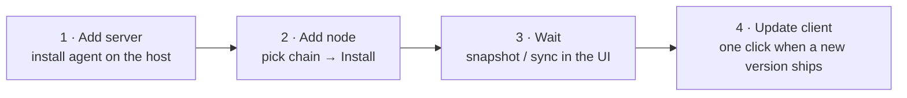
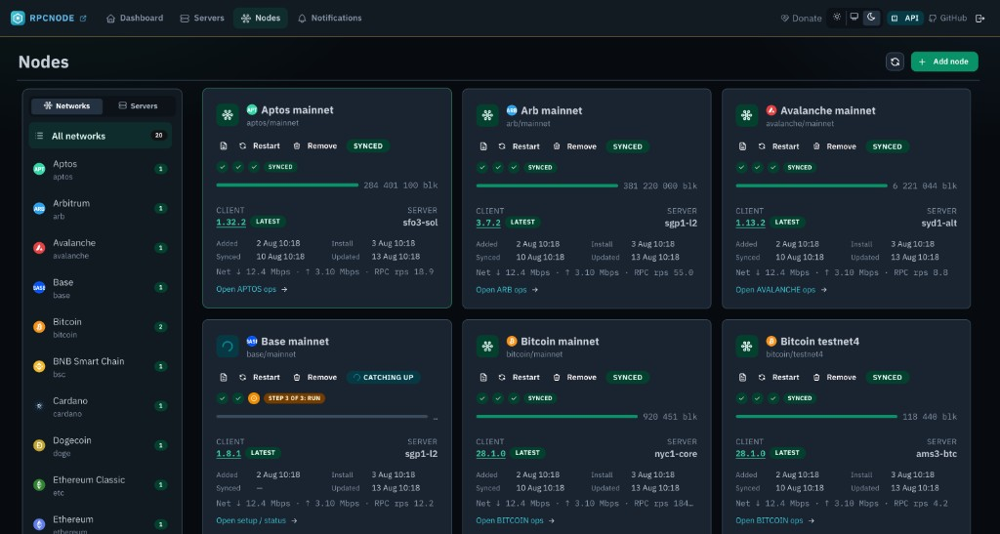
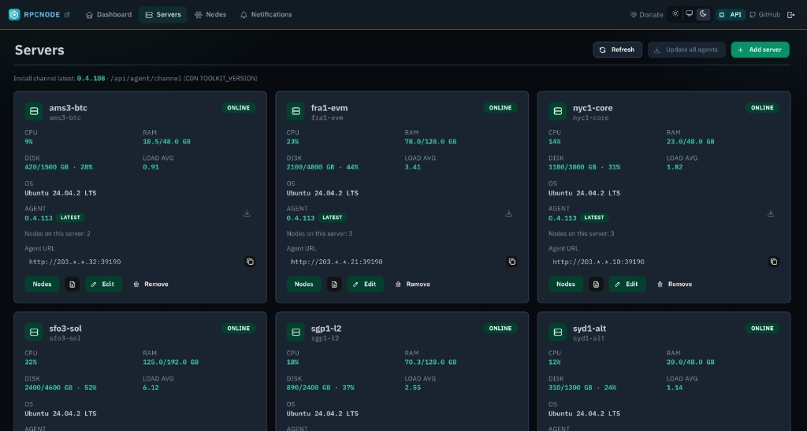
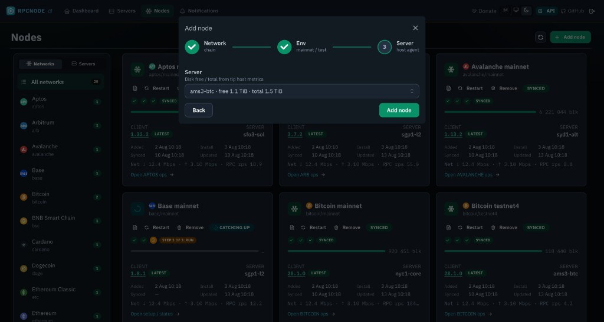
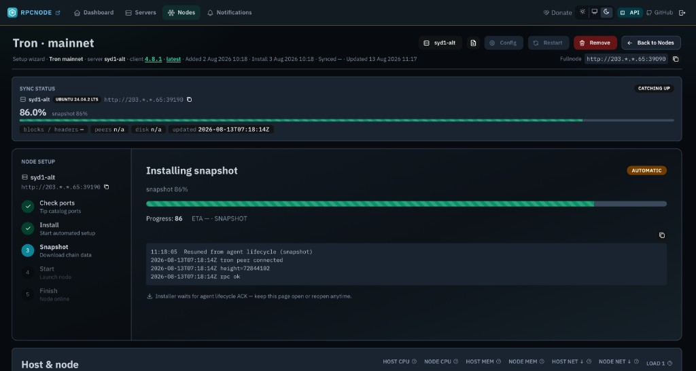

<p align="center">
  
</p>

<h1 align="center">RpcNode — crypto full node toolkit</h1>

<p align="center">
  <strong>Self-hosted crypto full nodes — many networks, one control plane.</strong>
</p>

<p align="center">
  <a href="https://rpcnode.dev">rpcnode.dev</a>
  ·
  <a href="docs/developer-api.md">Developer API</a>
  ·
  <a href="docs/architecture-control-plane.md">Architecture</a>
  ·
  <a href="docs/releasing.md">Releases</a>
</p>



| Step | In the panel | On the machine |
|---|---|---|
| **1. Add server** | **Servers → Add server** — paste the agent URL | <code>curl -fsSL https://rpcnode.dev/install/agent.sh \| sudo bash</code> once per host |
| **2. Add node** | **Nodes → Add node** → network → env → server → **Install** | Agent provisions units, conf, snapshot — no SSH playbook |
| **3. Wait** | NODE SETUP + honest **sync %** and logs | Chain client downloads / IBD / catch-up until **SYNCED** |
| **4. Update client** | Node card / detail → **Update client** when the badge is not LATEST | Agent swaps the chain binary and restarts that node |

Same host, next chain: skip step 1 — **Add node** again.

RpcNode is a **crypto full node** tool for teams that run **their own** cryptocurrency full nodes: exchanges, wallets, indexers, payment processors, and infra crews who cannot depend on a shared SaaS RPC.

Without it, every chain is a different job. Bitcoin, Ethereum, Solana, TRON, L2s — each crypto full node network has its own installer, ports, snapshots, systemd units, and a journal you have to SSH into to guess whether sync is actually moving. Multiply that by mainnet and testnet, then by a few servers, and ops becomes a pile of one-off scripts.

You keep the hardware and the keys. The panel is only the control plane — it does not sit in the RPC path of your users.

**What you stop doing by hand:** hunting snapshot URLs, mixing prune presets with “full node”, copying ports from another chain, and calling a node healthy because `curl` returned a tip. Nodes here are **full history** (archive / unpruned), sized and configured for production RPC, not a 7-day window.

**What you see instead:** one UI for every host and every chain — install wizard, snapshot download, catch-up, client version, restart/remove, metrics. One agent per server can run many networks; adding Bitcoin next to TRON is another row, not another product.

<p align="center">
  
</p>

<p align="center">
  
  &nbsp;
  
</p>
<p align="center">
  
</p>


## Crypto full node networks

Aptos · Arbitrum · Avalanche · Base · Bitcoin · Bitcoin Cash · BNB Smart Chain · Cardano · Dash · Dogecoin · Ethereum · Ethereum Classic · Hyperliquid · Litecoin · Optimism · Robinhood · Solana · Stellar · Sui · Toncoin · TRON · XRP Ledger · Zcash

Each profile is a **full-history crypto full node** (archive / unpruned RPC), not a light client or a 7-day window.

## Quick start

### 1. Panel (control host)

```bash
./scripts/up-panel.sh
open http://127.0.0.1:8093/
```

That is enough: the script asks for admin login/password (writes `config/nginx/htpasswd/panel.htpasswd` on the host), builds `rpcnode-panel:local` from `./Dockerfile`, creates the compose network, and starts panel / collector / watchdog. Do not `docker compose pull`. Then open `/login`.

Update the panel after pulling this repo (rebuild image, no Docker Hub pull). The SPA is compiled in Docker — do not commit `panel/ui`:

```bash
docker compose -f docker-compose.panel.yml up -d --build --pull never
```

SQLite (`panel.db`) lives in the Docker volume `panel-lib` (`/var/lib/rpcnode`). Recreate/rebuild does not wipe servers or nodes.

### 2. Agent (blockchain server)

```bash
curl -fsSL https://rpcnode.dev/install/agent.sh | sudo bash
```

The installer prints a register URL + API key. In the panel: **Servers → Add server** (paste the agent URL).  
Details: [`docs/agent-install.md`](docs/agent-install.md)

### 3. Add a node

**Nodes → Add node** → network → env → server → **Add node**. Confirm ports, then watch install / snapshot / sync in the UI.

Same flow from CLI (panel must be up):

```bash
./scripts/add-node.sh --server nyc1-core --network bitcoin --env mainnet
./scripts/remove-node.sh --server nyc1-core --network bitcoin --env mainnet
```

## How it fits together

```text
  ops host :8093                         blockchain server
┌──────────────────────┐                ┌─────────────────────────────┐
│  rpcnode-panel       │   agent API    │  tip agent (host-wide)      │
│  UI + SQLite         │ ─────────────► │  rpcnode-api-agent          │
│  registry, collector │                │  rpcnode-system-agent       │
└──────────────────────┘                │            │                │
                                        │            ▼                │
                                        │  per-node units (leaf)      │
                                        │  bitcoin / eth / sol / …    │
                                        │  public Go RPC  :39x90      │
                                        └─────────────────────────────┘
```

Clients hit the **public Go RPC** port on the node. Humans use the **panel**. Do not point `servers.agent_url` at the chain RPC port — that is the tip **agent** port.

More detail: [`docs/architecture-control-plane.md`](docs/architecture-control-plane.md) · panel ops: [`panel/README.md`](panel/README.md)

## Agent API

Public chain RPC is unauthenticated. Agent JSON (`/api/v1/*`) uses `AGENT_API_TOKEN`.

```bash
curl -H "Authorization: Bearer $AGENT_API_TOKEN" \
  http://127.0.0.1:39090/api/v1/node
```

Panel session token (30 days):

```bash
TOKEN=$(./scripts/panel-token.sh)
curl -H "Authorization: Bearer $TOKEN" http://127.0.0.1:8093/api/auth/status
```

Schema: [`docs/developer-api.md`](docs/developer-api.md)

## Reset panel password

```bash
docker exec rpcnode-panel rpcnode-panel passwd admin --password 'new-secret'
docker restart rpcnode-panel
```

## Prebuilt binaries

```bash
./scripts/build-agent-binaries.sh
# → dist/binaries/rpcnode-{api,system}-agent-{linux,darwin}-{amd64,arm64}
```

Install URLs: [rpcnode.dev/install/agent.sh](https://rpcnode.dev/install/agent.sh) · [binaries](https://rpcnode.dev/install/binaries/)

## Releases

Agent channel = `TOOLKIT_VERSION` + git tag `vX.Y.Z` + CDN. Do not retag a version that already shipped.

```bash
./scripts/release.sh bump patch
git add TOOLKIT_VERSION && git commit -m "Release 0.4.114"
./scripts/release.sh tag --push
./scripts/release.sh publish
```

Details: [`docs/releasing.md`](docs/releasing.md).

RpcNode is open-source infrastructure for operators who want a single **crypto full node** toolkit instead of a pile of per-chain scripts.

## Donate

If RpcNode saves you time, tips on **TRON** are welcome.

| Network | Address |
|---|---|
| TRON (TRX / USDT-TRC20) | `TCaLmNocrKGhJwRfQfnHvjxmL7MJS66KFV` |

In the panel: **Donate** (header or footer).
