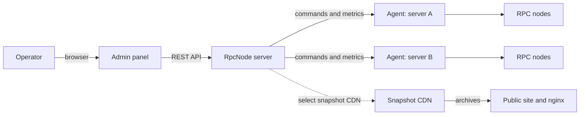

<p align="center">
  
</p>

<h1 align="center">RpcNode</h1>

<p align="center">
  <strong>A self-hosted platform for managing blockchain RPC infrastructure.</strong><br>
  Manage servers, nodes, clients, and snapshots from one interface.
</p>

<p align="center">
  <a href="#features">Features</a> ·
  <a href="#architecture">Architecture</a> ·
  <a href="#repository-layout">Components</a> ·
  <a href="#local-development">Development</a> ·
  <a href="#deployment">Deployment</a>
</p>

---

## Your servers, your nodes, your control

Running RPC nodes manually quickly becomes a collection of disconnected SSH
sessions, scripts, logs, and spreadsheets. You need to monitor availability,
synchronization, and disk usage, update clients, and securely connect new
machines.

**RpcNode** combines these operational tasks into a single control plane that
runs in your infrastructure. The panel manages configuration and state, while
an agent on every connected server executes commands and reports metrics. Your
nodes and data remain in your environment.

## Features

- **Server management.** Connect hosts, install the agent, check availability,
  and view system metrics.
- **Node lifecycle.** Create nodes for the required network and environment,
  and manage processes, ports, data, and logs.
- **Health monitoring.** Track sync status, block height, disk utilization,
  network traffic, and port diagnostics.
- **Client management.** Download, install, and update node-client versions
  without per-server scripts.
- **Snapshot CDN.** Mirror archives for fast initial sync, publish a download
  site, and track download statistics.
- **Extensible network catalog.** Declarative YAML definitions with isolated
  implementation logic for blockchain-specific behavior.

### Supported networks

Arbitrum, Base, Bitcoin, Bitcoin Cash, BNB Smart Chain, Dash, Dogecoin,
Ethereum, Hyperliquid, Litecoin, Polygon, Solana, Sui, TON, TRON, XRPL, and
Zcash.

## Architecture



| Component | Purpose |
| --- | --- |
| **RpcNode server** | Ktor application with REST API, business logic, and SQLite storage. |
| **Admin panel** | React operator interface. |
| **RpcNode agent** | Agent on a managed host that starts nodes, accepts commands, and collects metrics. |
| **Snapshot CDN** | Independent snapshot-archive mirroring service. |
| **CDN site** | Next.js site that lists available archives and provides download links. |

The backend follows a hexagonal architecture: the HTTP layer is separated from
use cases, domain models, and infrastructure adapters. See the package map,
diagrams, and API reference in [app/ARCHITECTURE.md](app/ARCHITECTURE.md).

## Repository layout

| Directory | Contents |
| --- | --- |
| `app/` | Kotlin/Ktor server, agent, and CDN synchronizer in one Gradle project with three JARs. |
| `admin/` | React, Vite, and Mantine administration panel. |
| `cdn-site/` | Public Next.js site for the snapshot CDN. |
| `scripts/` | Scripts to build and install the server, agent, and CDN as systemd services. |
| `deploy/nginx-cdn/` | nginx configuration for serving snapshot archives. |

The backend build creates separate artifacts:

```text
rpcnode-server.jar  Control panel and REST API
rpcnode-agent.jar   Managed-server agent
rpcnode-cdn.jar     Snapshot archive synchronizer
```

## Docker

You do not need a source checkout to run RpcNode. Download the
`rpcnode-vX.Y.Z.tar.gz` archive from [GitHub Releases](../../releases), extract
it, and start Docker Compose:

```bash
tar -xzf rpcnode-vX.Y.Z.tar.gz
cd rpcnode-vX.Y.Z
docker compose up -d --build
```

The panel is then available at `http://127.0.0.1:8093`. The interface and API
share the same origin. Server data, accounts, sessions, logs, downloaded
clients, and the agent JAR are stored in the named `rpcnode-data` Docker volume.

To use a different external port, set `RPCNODE_PORT`:

```bash
RPCNODE_PORT=8080 docker compose up -d --build
```

Start the snapshot CDN and its public site with a separate profile:

```bash
docker compose --profile cdn up -d --build
```

Its default HTTP address is `http://127.0.0.1:8095`; change the port with
`CDN_HTTP_PORT`. CDN archives and settings are stored in the
`rpcnode-cdn-data` volume. After it starts, add the required mirrors:

```bash
docker compose exec cdn menu
```

Connect a node server by downloading the agent from the panel's public address:

```bash
curl -fsSL -o rpcnode-agent.jar http://127.0.0.1:8093/install/binaries/rpcnode-agent.jar \
  && sudo java -jar rpcnode-agent.jar install
```

Full user and operations documentation is available at
[toolkit.rpcnode.dev](https://toolkit.rpcnode.dev/).

### Publishing a release

Use the release script. It bumps the server/`PANEL_VERSION`, builds the three
JARs, commits, tags `vX.Y.Z`, pushes, and creates a GitHub Release with the
artifacts:

```bash
./scripts/release.sh          # bump patch (e.g. 0.1.1 -> 0.1.2)
./scripts/release.sh 0.2.0    # set an explicit version
./scripts/release.sh --dry-run
```

Requires a clean git tree, `gh` auth, and push access to `origin`.

## Local development

JDK 26 and Node.js 22.12 or later are required.

```bash
# Backend: build and run tests
cd app
./gradlew test agentTest cdnTest

# Admin panel
cd ../admin
cp .env.example .env
npm ci
npm run dev
```

The admin panel is available at `http://127.0.0.1:5173`. Start the backend from
IntelliJ IDEA with `rpcnode.toolkit.panel.presentation.http.ApplicationKt`; it
listens on `http://127.0.0.1:8093` by default. Set the API address with
`VITE_API_URL` in `admin/.env`.

To work on the snapshot site:

```bash
cd cdn-site
npm ci
npm run build
npm start
```

See the [backend](app/README.md), [admin panel](admin/README.md), and
[snapshot CDN](cdn-site/README.md) documentation for details.

## Deployment

Build artifacts from the repository root. Argument `0` keeps the current
version; `1` increments the patch version.

```bash
./scripts/build-rpcnode-server.sh 0
./scripts/build-rpcnode-agent.sh 0
./scripts/build-rpcnode-cdn.sh 0
```

Install the server on the control-plane host:

```bash
sudo ./scripts/install-rpcnode-server.sh --install
```

An agent host is the server that will run nodes. Download the agent from the
panel and install it on that host:

```bash
curl -fsSL -o rpcnode-agent.jar http://127.0.0.1:8093/install/binaries/rpcnode-agent.jar \
  && sudo java -jar rpcnode-agent.jar install
```

For a dedicated snapshot CDN, copy `rpcnode-cdn.jar` to the CDN host, install
it, then select mirrors through its menu:

```bash
sudo java -jar rpcnode-cdn.jar install
sudo java -jar /opt/rpcnode/lib/rpcnode-cdn.jar menu
sudo systemctl restart rpcnode-cdn
```

You can run the public CDN site through Docker from `cdn-site/`; nginx must
serve `/snapshots/*` from disk. See the complete guide in
[deploy/nginx-cdn/README.md](deploy/nginx-cdn/README.md).

Install scripts support updates and uninstalls without deleting data:
`--update` and `--uninstall` for the server/CDN, and `update` and `uninstall`
for the agent.

## Adding a network

Network definitions live in `app/src/main/resources/chains/<network-id>/`.
Before implementation, complete the
[intake questionnaire](app/docs/adding-a-network-intake.md), which records
client, port, snapshot, and operating-scenario requirements. Then use an
existing network as a reference and follow the checklist in that document.

## Documentation

| Topic | Document |
| --- | --- |
| Architecture and REST API | [app/ARCHITECTURE.md](app/ARCHITECTURE.md) |
| Backend development guidance | [app/AGENTS.md](app/AGENTS.md) |
| Admin panel | [admin/README.md](admin/README.md) |
| Public snapshot CDN site | [cdn-site/README.md](cdn-site/README.md) |
| nginx for the CDN | [deploy/nginx-cdn/README.md](deploy/nginx-cdn/README.md) |
