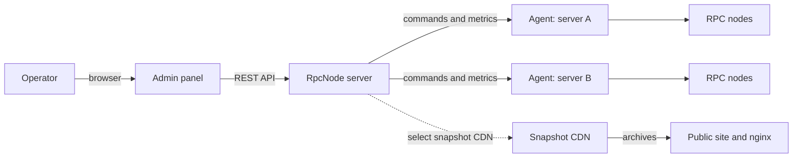

<p align="center">
  
</p>

<h1 align="center">RpcNode</h1>

<p align="center">
  <strong>A self-hosted platform for managing blockchain RPC infrastructure.</strong><br>
  Manage servers, nodes, clients, and snapshots from one interface.
</p>

<p align="center">
  <a href="#features">Features</a> ·
  <a href="#architecture">Architecture</a> ·
  <a href="#repository-layout">Components</a> ·
  <a href="#local-development">Development</a> ·
  <a href="#deployment">Deployment</a>
</p>

---

## Your servers, your nodes, your control

Running RPC nodes manually quickly becomes a collection of disconnected SSH
sessions, scripts, logs, and spreadsheets. You need to monitor availability,
synchronization, and disk usage, update clients, and securely connect new
machines.

**RpcNode** combines these operational tasks into a single control plane that
runs in your infrastructure. The panel manages configuration and state, while
an agent on every connected server executes commands and reports metrics. Your
nodes and data remain in your environment.

## Features

- **Server management.** Connect hosts, install the agent, check availability,
  and view system metrics.
- **Node lifecycle.** Create nodes for the required network and environment,
  and manage processes, ports, data, and logs.
- **Health monitoring.** Track sync status, block height, disk utilization,
  network traffic, and port diagnostics.
- **Client management.** Download, install, and update node-client versions
  without per-server scripts.
- **Snapshot CDN.** Mirror archives for fast initial sync, publish a download
  site, and track download statistics.
- **Extensible network catalog.** Declarative YAML definitions with isolated
  implementation logic for blockchain-specific behavior.

### Supported networks

Arbitrum, Base, Bitcoin, Bitcoin Cash, BNB Smart Chain, Dash, Dogecoin,
Ethereum, Hyperliquid, Litecoin, Polygon, Solana, Sui, TON, TRON, XRPL, and
Zcash.

## Architecture


```mermaid
flowchart LR
  Operator[Operator] -->|browser| Admin[Admin panel]
  Admin -->|REST API| Panel[RpcNode server]
  Panel -->|commands and metrics| AgentA[Agent: server A]
  Panel -->|commands and metrics| AgentB[Agent: server B]
  AgentA --> NodesA[RPC nodes]
  AgentB --> NodesB[RPC nodes]
  Cdn[Snapshot CDN] -->|archives| PublicSite[Public site and nginx]
  Panel -.->|select snapshot CDN| Cdn
```

| Component | Purpose |
| --- | --- |
| **RpcNode server** | Ktor application with REST API, business logic, and SQLite storage. |
| **Admin panel** | React operator interface. |
| **RpcNode agent** | Agent on a managed host that starts nodes, accepts commands, and collects metrics. |
| **Snapshot CDN** | Independent snapshot-archive mirroring service. |
| **CDN site** | Next.js site that lists available archives and provides download links. |

The backend follows a hexagonal architecture: the HTTP layer is separated from
use cases, domain models, and infrastructure adapters. See the package map,
diagrams, and API reference in [app/ARCHITECTURE.md](app/ARCHITECTURE.md).

## Repository layout

| Directory | Contents |
| --- | --- |
| `app/` | Kotlin/Ktor server, agent, and CDN synchronizer in one Gradle project with three JARs. |
| `admin/` | React, Vite, and Mantine administration panel. |
| `cdn-site/` | Public Next.js site for the snapshot CDN. |
| `scripts/` | Scripts to build and install the server, agent, and CDN as systemd services. |
| `deploy/nginx-cdn/` | nginx configuration for serving snapshot archives. |

The backend build creates separate artifacts:

```text
rpcnode-server.jar  Control panel and REST API
rpcnode-agent.jar   Managed-server agent
rpcnode-cdn.jar     Snapshot archive synchronizer
```

## Docker

You do not need a source checkout to run RpcNode. Download the
`rpcnode-vX.Y.Z.tar.gz` archive from [GitHub Releases](../../releases), extract
it, and start Docker Compose:

```bash
tar -xzf rpcnode-vX.Y.Z.tar.gz
cd rpcnode-vX.Y.Z
docker compose up -d --build
```

Published ports (do not give both the same number):

| Service | Default | Override |
| --- | --- | --- |
| **Admin UI** (`rpcnode-admin`) | **8093** | `RPCNODE_PORT` |
| **Server API** (`rpcnode-server`) | **8094** | `RPCNODE_SERVER_PORT` |
| Snapshot CDN | **8095** | `CDN_HTTP_PORT` |

```text
http://127.0.0.1:8093   admin UI
http://127.0.0.1:8094   rpcnode-server  (API, /install, /healthz)
```

The browser can stay on `:8093`: admin nginx proxies `/api` and `/install` to
the server on `:8094`. First-run setup asks for the **server origin**
(`http://<host>:8094`), checks `/healthz`, then creates the admin password —
it does not call `127.0.0.1:8094` before you pick a host. Agents and other
containers must use the **Docker host IP or DNS** plus the published port —
`127.0.0.1` inside another container is that container itself, not
`rpcnode-server`.

Server data lives on the host at `./data` (override with `RPCNODE_DATA`):

```text
./data/database/toolkit.db
./data/database/panel.htpasswd
./data/database/panel-sessions.json
./data/install/          # agent JAR, client tarballs
./data/logs/server.log
```

```bash
RPCNODE_PORT=8080 docker compose up -d --build          # admin UI
RPCNODE_SERVER_PORT=8094 docker compose up -d --build   # server API (default)
```

Start the snapshot CDN and its public site with a separate profile:

```bash
docker compose --profile cdn up -d --build
```

Its default HTTP address is `http://127.0.0.1:8095`; change the port with
`CDN_HTTP_PORT`. CDN archives and settings are stored in the
`rpcnode-cdn-data` volume. After it starts, add the required mirrors:

```bash
docker compose exec cdn menu
```

Connect a node host by downloading the agent from **rpcnode-server** (`:8094`).
From another machine or container use the Docker host IP or DNS, not
`127.0.0.1`:

```bash
curl -fsSL -o rpcnode-agent.jar http://<docker-host>:8094/install/binaries/rpcnode-agent.jar \
  && sudo java -jar rpcnode-agent.jar install
```

Through the admin UI proxy the same file is also at `http://<docker-host>:8093/install/binaries/rpcnode-agent.jar`.

Full user and operations documentation is available at
[toolkit.rpcnode.dev](https://toolkit.rpcnode.dev/).

### Publishing a release

Everything goes through **one script**, `scripts/rpcnode.sh` (run it with no
arguments for a menu, or `./scripts/rpcnode.sh help`). On Windows use
`scripts\rpcnode.cmd` (build, release, stop; install/remove run on the Linux
host). The implementation pieces live in `scripts/lib/` — you never call them.

`release` bumps the server version, `PANEL_VERSION` and the **agent version**
(installed agents update only when it changes) and builds the three JARs. In a
terminal it asks how far to go; the same choice is available as a flag:

| Mode | Flag | What happens |
| --- | --- | --- |
| Build only | `--build-only` | Jars and checksums in `dist/release/`; version files are put back, nothing is committed or tagged. |
| Commit + tag | `--tag-only` | Also a version commit and the tag `vX.Y.Z` on this machine; nothing is pushed. |
| Full release | `--publish` (default) | Also pushes the tag and creates the GitHub Release with the jars. |


```bash
./scripts/rpcnode.sh release -m "notes"            # bump patch (e.g. 0.1.1 -> 0.1.2)
./scripts/rpcnode.sh release 0.2.0 -m "notes"      # set an explicit version
./scripts/rpcnode.sh release -m "notes" --dry-run
./scripts/rpcnode.sh release -m "notes" --build-only
./scripts/rpcnode.sh release -m "notes" --no-agent-bump
```

Tag and full-release modes need a clean git tree; full release also needs `gh` auth and push access to `origin`.

## Local development

JDK 26 and Node.js 22.12 or later are required.

```bash
# Backend: build and run tests
cd app
./gradlew test agentTest cdnTest

# Admin panel
cd ../admin
cp .env.example .env
npm ci
npm run dev
```

The admin panel is available at `http://127.0.0.1:5173`. Start the backend from
IntelliJ IDEA with `rpcnode.toolkit.panel.presentation.http.ApplicationKt`; it
listens on `http://127.0.0.1:8094` by default. First-run setup asks for that
origin, then the admin password. `VITE_API_URL` in `admin/.env` is optional.

To work on the snapshot site:

```bash
cd cdn-site
npm ci
npm run build
npm start
```

See the [backend](app/README.md), [admin panel](admin/README.md), and
[snapshot CDN](cdn-site/README.md) documentation for details.

## Deployment

All operations are subcommands of `scripts/rpcnode.sh`:

```bash
./scripts/rpcnode.sh build [server|agent|cdn|all] [--bump-agent]   # jars -> app/build/libs
./scripts/rpcnode.sh install server|agent|cdn      # this host (asks for sudo itself)
./scripts/rpcnode.sh update  server|agent|cdn
./scripts/rpcnode.sh remove  nodes|agent|server|cdn|all [--purge] [-y]
./scripts/rpcnode.sh status                        # services and agent versions
```

Without a release, build the agent first and the server second
(`build all` does it): the server jar carries the agent version, and agents
update when the version the panel announces differs from their own. Add
`--bump-agent` to change it.

`remove nodes` stops and deletes all node services (chain data stays on disk).
`remove all` removes nodes, agent, panel and CDN service from the host;
`--purge` additionally deletes the panel database and admin account.

Install the server on the control-plane host:

```bash
./scripts/rpcnode.sh install server
```

An agent host is the machine that will run nodes. Download the agent from
**rpcnode-server** on **:8094** (not the admin UI on :8093) and install it
there. From another host use that machine's IP or DNS:

```bash
curl -fsSL -o rpcnode-agent.jar http://<control-host>:8094/install/binaries/rpcnode-agent.jar \
  && sudo java -jar rpcnode-agent.jar install
```

`install server` listens on **8094** (`PANEL_PORT`). The admin UI
stays on **8093** (Docker container, or pm2 — see below). When there is no
local `app/build/libs/rpcnode-server.jar`, the installer downloads the jar of
this checkout's version from GitHub Releases (`RPCNODE_VERSION=0.1.8` picks
another one).

### Admin UI without Docker (pm2)

The admin UI is a static React build. `admin/server.mjs` serves it and proxies
`/api`, `/install` and `/healthz` to **rpcnode-server** — the same job nginx
does in the Docker image — so one process on **:8093** is enough. It has no
dependencies besides Node.js 22.12+.

```bash
cd admin
npm ci
npm run build                # writes admin/dist
sudo npm install -g pm2      # once

pm2 start ecosystem.config.cjs
pm2 save                     # remember the process list
pm2 startup                  # prints one command — run it to start on boot
```

It listens on `0.0.0.0:8093`, so it is reachable from other machines once the
port is open:

```bash
sudo ufw allow 8093/tcp      # or the equivalent in your firewall / security group
```

Settings (environment of the pm2 process, defaults in `ecosystem.config.cjs`):

| Variable | Default | Meaning |
| --- | --- | --- |
| `ADMIN_HOST` | `0.0.0.0` | Bind address. `127.0.0.1` keeps it local (e.g. behind your own reverse proxy / TLS). |
| `ADMIN_PORT` | `8093` | Listen port. |
| `PANEL_URL` | `http://127.0.0.1:8094` | Where rpcnode-server runs. |

**First-run setup** asks for the server origin, and the browser then talks to
it directly. Enter `http://<host>:8094` (the address agents use too) and let
the panel accept the admin's origin: add this line to
`/etc/rpcnode/rpcnode-server.env` and restart the server (the installer does not
set it, and without it the browser blocks the calls with a CORS error):

```bash
echo 'PANEL_CORS_ORIGINS=' | sudo tee -a /etc/rpcnode/rpcnode-server.env
sudo systemctl restart rpcnode-server
```

An empty value means "any origin" (as in `compose.yaml`); use
`PANEL_CORS_ORIGINS=http://<host>:8093` to allow only the admin. Alternatively
enter the admin's own address (`http://<host>:8093`) as the server: requests
then go through the proxy on the same origin and no CORS setting is needed.

**Update** (after `git pull`):

```bash
cd admin
npm ci && npm run build     # new UI → admin/dist
```

That is all for a UI change: `server.mjs` reads `dist/` on every request, so no
restart is needed — reload the browser tab (Ctrl+F5).

Restart the process only when `server.mjs`, `ecosystem.config.cjs` or its
environment changed:

```bash
pm2 restart rpcnode-admin --update-env   # re-reads ADMIN_HOST / ADMIN_PORT / PANEL_URL
# changed ecosystem.config.cjs itself? reload it from the file:
pm2 reload ecosystem.config.cjs --update-env
```

Other commands:

```bash
pm2 status                   # is it running
pm2 logs rpcnode-admin       # proxy errors show up here (502 panel_unreachable)
pm2 stop rpcnode-admin       # stop (pm2 start rpcnode-admin starts it again)
pm2 delete rpcnode-admin     # remove from pm2; run pm2 save afterwards
```

The process name is `rpcnode-admin` (set in `ecosystem.config.cjs`). The server
(`rpcnode-server`) and the agent are systemd services, not pm2: update them with
`bash ./scripts/rpcnode.sh update server` and `... update agent`.

`server.mjs` speaks plain HTTP. For HTTPS put nginx/Caddy in front and set
`ADMIN_HOST=127.0.0.1`.

For a dedicated snapshot CDN, copy `rpcnode-cdn.jar` to the CDN host, install
it, then select mirrors through its menu:

```bash
sudo java -jar rpcnode-cdn.jar install
sudo java -jar /opt/rpcnode/lib/rpcnode-cdn.jar menu
sudo systemctl restart rpcnode-cdn
```

You can run the public CDN site through Docker from `cdn-site/`; nginx must
serve `/snapshots/*` from disk. See the complete guide in
[deploy/nginx-cdn/README.md](deploy/nginx-cdn/README.md).

`update` replaces the jar and keeps all data; `remove` deletes the service
but keeps the database (`remove server --purge` deletes it too).

## Adding a network

Network definitions live in `app/src/main/resources/chains/<network-id>/`.
Before implementation, complete the
[intake questionnaire](app/docs/adding-a-network-intake.md), which records
client, port, snapshot, and operating-scenario requirements. Then use an
existing network as a reference and follow the checklist in that document.

## Documentation

| Topic | Document |
| --- | --- |
| Architecture and REST API | [app/ARCHITECTURE.md](app/ARCHITECTURE.md) |
| Backend development guidance | [app/AGENTS.md](app/AGENTS.md) |
| Admin panel | [admin/README.md](admin/README.md) |
| Public snapshot CDN site | [cdn-site/README.md](cdn-site/README.md) |
| nginx for the CDN | [deploy/nginx-cdn/README.md](deploy/nginx-cdn/README.md) |
