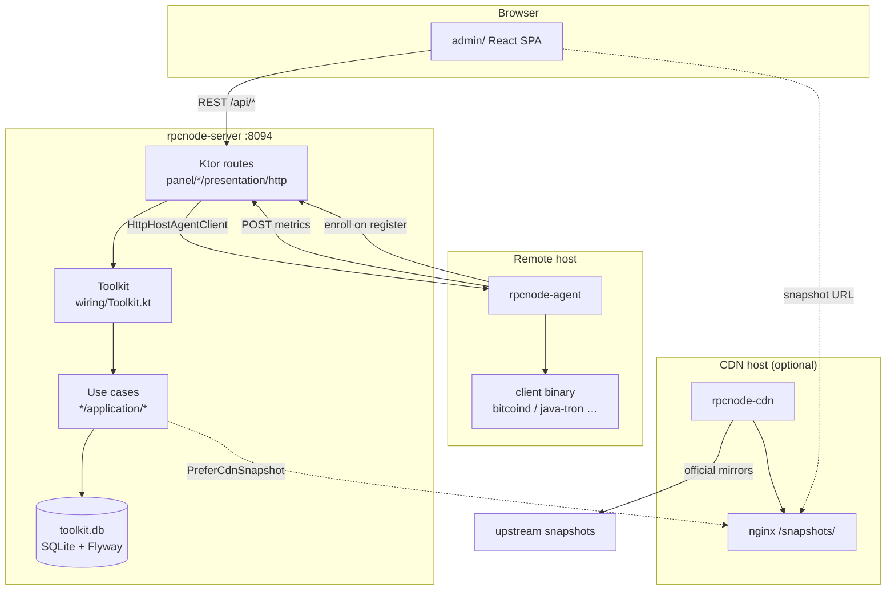
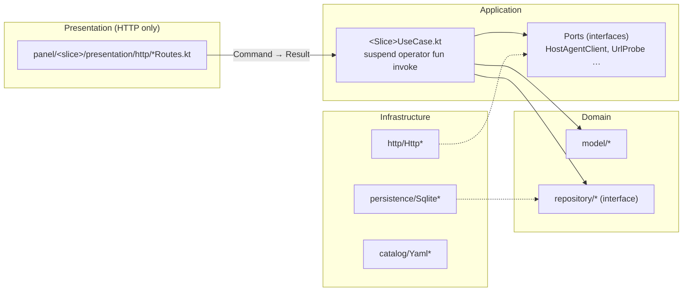
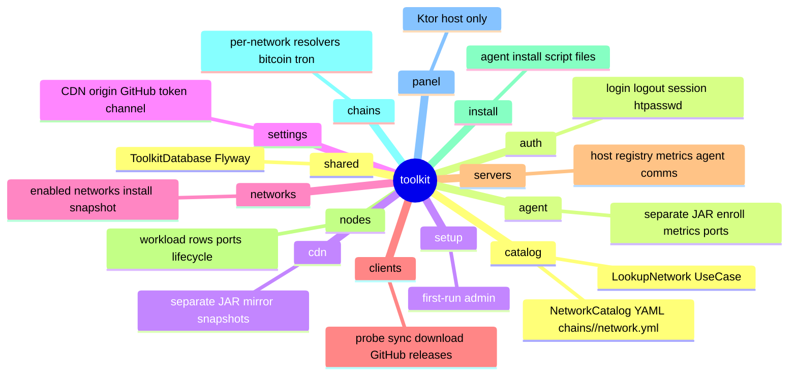
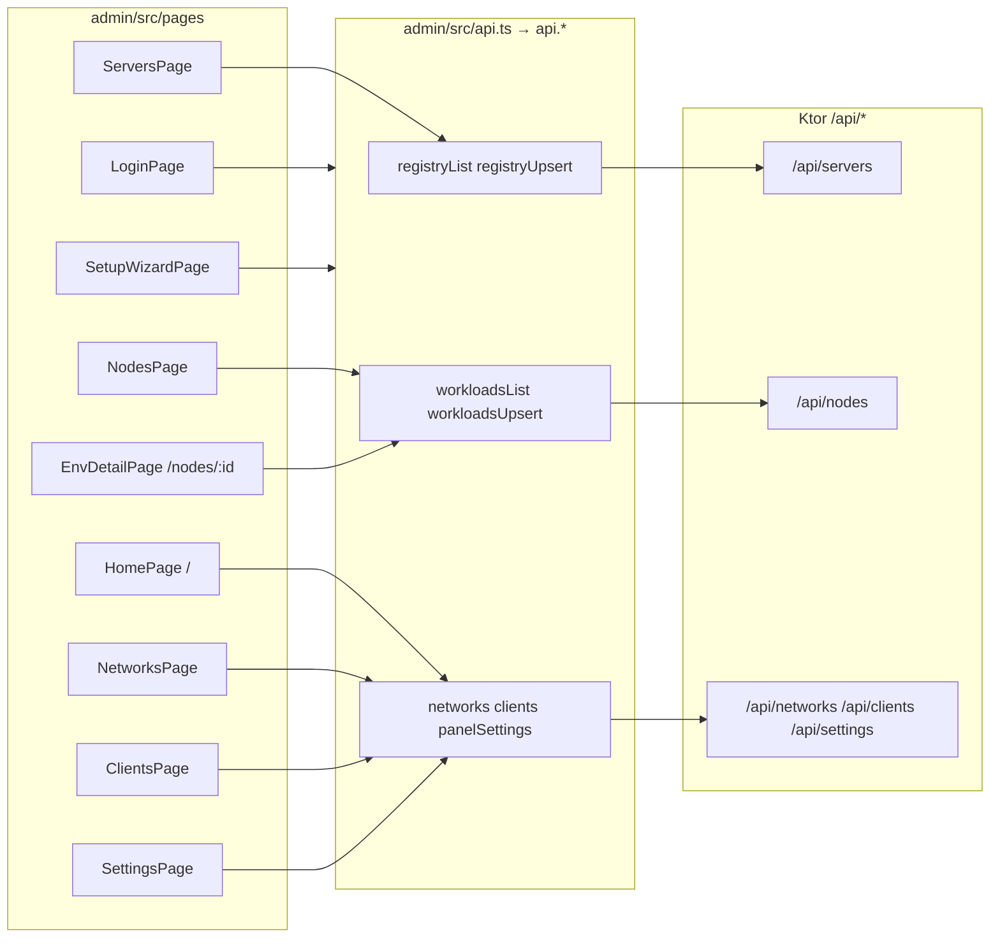
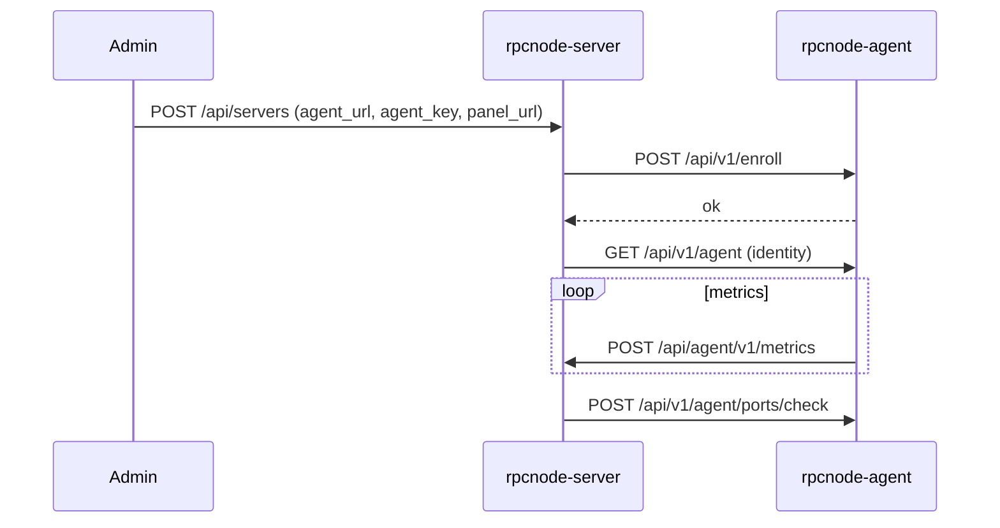
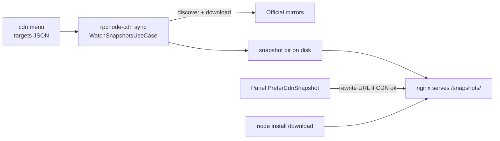
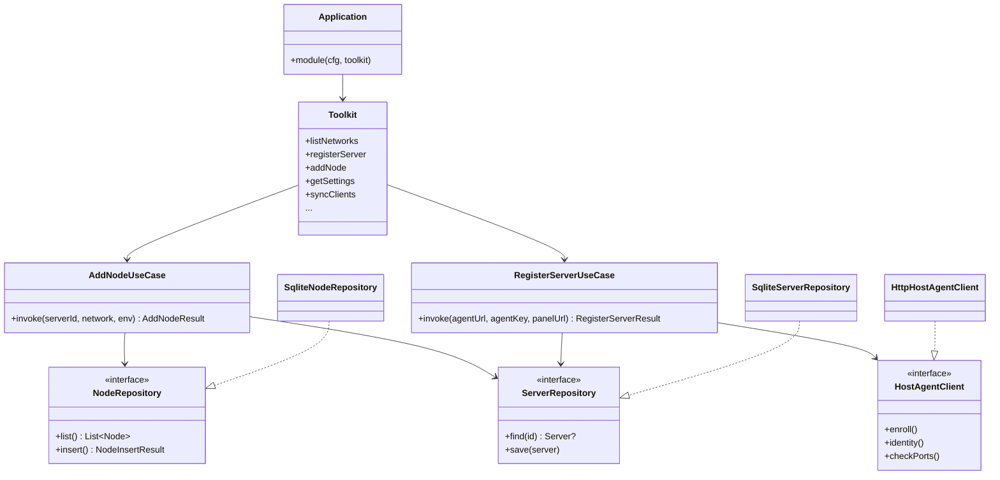
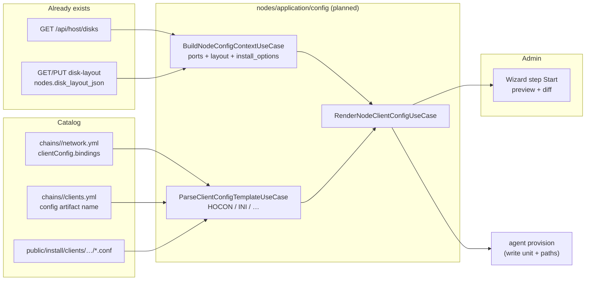

# toolkit-kotlin — architecture map

**UML for the IDE:** [`docs/toolkit-architecture.puml`](docs/toolkit-architecture.puml) — PlantUML, 11 diagrams in one file. IntelliJ: *PlantUML integration* plugin → open file → preview (Alt+D).

Quick navigation: “where to change X”. Three binaries from one Gradle project (`app/`).

**Adding a network:** fill the intake questionnaire first —
[`docs/adding-a-network-intake.md`](docs/adding-a-network-intake.md)
(example: [`docs/networks/bitcoin-intake.md`](docs/networks/bitcoin-intake.md)), get answers
approved, then implement the wiring checklist in that document.

```
rpcnode-server.jar   ← src/main   (panel + business slices)
rpcnode-agent.jar    ← src/agent  (host agent)
rpcnode-cdn.jar      ← src/cdn    (snapshot archive mirror)
admin/               ← React SPA (Vite)
```

---

## 1. Deployment (component diagram)



---

## 2. Layers (hexagonal) — one slice



**Package rule:** business logic does **not** live under `panel.*`. Example: `rpcnode.toolkit.nodes.domain`, HTTP — `rpcnode.toolkit.panel.nodes.presentation.http`.

---

## 3. Bounded contexts (slices)



| Slice | Package | SQLite table | Static data |
|-------|---------|--------------|-------------|
| **catalog** | `catalog/` | — | `resources/chains/<id>/network.yml` |
| **auth** | `auth/` | sessions (V6) | `htpasswd` file |
| **setup** | `setup/` | — | — |
| **settings** | `settings/` | settings (V5) | `github-token`, notify key |
| **networks** | `networks/` | networks (V3) | facts YAML |
| **clients** | `clients/` | clients (V4) | `resources/chains/<id>/clients.yml` |
| **servers** | `servers/` | servers (V7), metrics (V9) | — |
| **nodes** | `nodes/` | nodes (V8) | — |
| **nodeconfig** *(planned)* | `nodes/application/config/` | uses `nodes.disk_layout_json` | `chains/<id>/network.yml` → `clientConfig` |
| **install** | `install/` | — | `install/` dir on disk |
| **chains** | `chains/<net>/` | — | chain-specific HTTP resolvers |

Composition root: **`wiring/Toolkit.kt`** — the only place that wires all use cases.

Panel entrypoint: **`panel/presentation/http/Application.kt`**.

---

## 4. HTTP API → use case → files

### Auth / Setup / Health

| Method | Path | Use case | Routes |
|--------|------|----------|--------|
| GET | `/healthz` | — | `HealthRoutes.kt` |
| GET | `/api/setup/status` | `GetSetupStatusUseCase` | `SetupRoutes.kt` |
| POST | `/api/setup` | `CreateAdminUseCase` | `SetupRoutes.kt` |
| GET | `/api/setup/check` | `RunSetupCheckUseCase` | `SetupRoutes.kt` |
| POST | `/api/setup/stage` | `SetSetupStageUseCase` | `SetupRoutes.kt` |
| POST | `/api/setup/finish` | `FinishSetupUseCase` | `SetupRoutes.kt` |
| GET | `/api/auth/status` | `GetAuthStatusUseCase` | `AuthRoutes.kt` |
| POST | `/api/auth/login` | `LoginUseCase` | `AuthRoutes.kt` |
| POST | `/api/auth/logout` | `LogoutUseCase` | `AuthRoutes.kt` |

### Settings

| Method | Path | Use case | Routes |
|--------|------|----------|--------|
| GET | `/api/settings` | `GetSettingsUseCase` | `SettingsRoutes.kt` |
| PUT | `/api/settings` | `SaveSettingsUseCase` | `SettingsRoutes.kt` |

### Networks

| Method | Path | Use case | Routes |
|--------|------|----------|--------|
| GET | `/api/networks` | `ListNetworksUseCase` | `NetworksRoutes.kt` |
| GET | `/api/networks/snapshot` | `PreferCdnSnapshotUseCase` / `ResolveSnapshotUseCase` | `NetworksRoutes.kt` |
| POST | `/api/networks` | `SetNetworkStatusUseCase` | `NetworksRoutes.kt` |
| POST | `/api/networks/install` | `CheckNetworkInstallUseCase` + download | `NetworksRoutes.kt` |
| DELETE | `/api/networks/{id}` | `RemoveNetworkUseCase` | `NetworksRoutes.kt` |

### Clients

| Method | Path | Use case | Routes |
|--------|------|----------|--------|
| GET | `/api/clients` | `ListClientsUseCase` | `ClientsRoutes.kt` |
| GET | `/api/clients/preview` | `PreviewClientsUseCase` | `ClientsRoutes.kt` |
| GET | `/api/clients/version` | `ResolveClientReleaseUseCase` | `ClientsRoutes.kt` |
| POST | `/api/clients` | `AddClientUseCase` | `ClientsRoutes.kt` |
| POST | `/api/clients/probe` | `ProbeClientsUseCase` | `ClientsRoutes.kt` |
| POST | `/api/clients/sync` | `SyncClientsUseCase` | `ClientsRoutes.kt` |
| POST | `/api/clients/delete` | `DeleteClientUseCase` | `ClientsRoutes.kt` |

### Servers (hosts / agents)

| Method | Path | Use case | Routes |
|--------|------|----------|--------|
| GET | `/api/servers` | `ListServersUseCase` | `ServersRoutes.kt` |
| POST | `/api/servers` | `RegisterServerUseCase` | `ServersRoutes.kt` |
| DELETE | `/api/servers/{id}` | `RemoveServerUseCase` | `ServersRoutes.kt` |
| POST | `/api/servers/probe` | `ProbeHostAgentUseCase` | `ServersRoutes.kt` |
| POST | `/api/v1/agent/update` | `UpdateHostAgentUseCase` | `ServersRoutes.kt` |
| POST | `/api/agent/v1/metrics` | `IngestServerMetricsUseCase` | `AgentIngestRoutes.kt` |

Panel → agent HTTP: **`servers/infrastructure/http/HttpHostAgentClient.kt`**

### Nodes (workloads)

| Method | Path | Use case | Routes |
|--------|------|----------|--------|
| GET | `/api/nodes` | `ListNodesUseCase` | `NodesRoutes.kt` |
| GET | `/api/nodes/{id}` | `GetNodeUseCase` | `NodesRoutes.kt` |
| POST | `/api/nodes` | `AddNodeUseCase` | `NodesRoutes.kt` |
| GET | `/api/nodes/{id}/ports` | `GetNodePortsUseCase` | `NodesRoutes.kt` |
| POST | `/api/nodes/{id}/ports/check` | `CheckNodePortsUseCase` | `NodesRoutes.kt` |
| POST | `/api/nodes/remove` | `RemoveNodeUseCase` | `NodesRoutes.kt` |

### Install

| Method | Path | Use case | Routes |
|--------|------|----------|--------|
| GET | `/install/version` | `RenderAgentScriptUseCase` | `InstallRoutes.kt` |
| GET | `/install/{path...}` | `ServeInstallFileUseCase` | `InstallRoutes.kt` |
| GET | `/api/agent/channel` | settings channel | `InstallRoutes.kt` |

---

## 5. Admin UI → backend



| Page | SPA path | Main API | Kotlin routes / use case |
|------|----------|----------|--------------------------|
| Dashboard | `/` | networks, servers, nodes | `ListNetworks`, `ListServers`, `ListNodes` |
| Servers | `/servers` | `api.registry*` | `ServersRoutes` → register/probe/remove |
| Nodes | `/nodes` | `api.workloadsList` | `NodesRoutes` → list |
| Node detail | `/nodes/:uuid` | `api.workloadsGet`, ports, disk… | `NodesRoutes`, agent proxy (some still legacy Go shapes in `api.ts`) |
| Networks | `/networks` | `api.networks*` | `NetworksRoutes` |
| Clients | `/clients` | `api.clients*` | `ClientsRoutes` |
| Settings | `/settings` | `api.panelSettings` | `SettingsRoutes` |
| Setup | `/setup` | `api.setup*` | `SetupRoutes` |
| Login | `/login` | `api.login` | `AuthRoutes` |

Node components: `NodeInstallWizard`, `NodePortsPanel`, `NodeConfigPanel` → `admin/src/components/`.

---

## 6. Agent (separate process)



| Agent endpoint | Use case | File |
|----------------|----------|------|
| GET `/healthz` | — | `agent/.../AgentRoutes.kt` |
| GET `/api/v1/agent` | `GetAgentIdentityUseCase` | AgentRoutes |
| GET `/api/v1/metrics` | `CollectHostMetricsUseCase` | AgentRoutes |
| POST `/api/v1/enroll` | `EnrollPanelUseCase` | AgentRoutes |
| POST `/api/v1/unenroll` | `UnenrollPanelUseCase` | AgentRoutes |
| POST `/api/v1/agent/update` | `UpdateAgentUseCase` | AgentRoutes |
| POST `/api/v1/agent/ports/check` | `CheckPortsUseCase` | AgentRoutes |

Entrypoint: **`agent/presentation/http/AgentMain.kt`**.

Agent ports: **`ReserveAgentPortsUseCase`**, **`ReserveAgentPortsOnStart.kt`**.

---

## 7. CDN mirror (separate process)

Panel-independent. Operator adds `network/env/type` via `java -jar rpcnode-cdn.jar menu`;
`sync` (systemd) discovers official upstream archives from shipped `cdn/mirrors.json`
and writes `snapshots/{network}/{env}/{type}/`.



| What | Package |
|------|---------|
| Poll + download | `cdn/application/sync/WatchSnapshotsUseCase.kt` |
| Local targets + discovery | `cdn/infrastructure/http/LocalSnapshotSource.kt` |
| Targets file | `cdn/infrastructure/filesystem/FileSnapshotTargetStore.kt` |
| Disk store | `cdn/infrastructure/filesystem/DiskSnapshotMirrorStore.kt` |
| CDN preference (panel) | `networks/application/snapshot/PreferCdnSnapshotUseCase.kt` |
| Settings model | `settings/domain/model/SnapshotCdnOrigin.kt` |
| nginx / install | `deploy/nginx-cdn/`, `scripts/install-rpcnode-cdn.sh` |

Entrypoint: **`cdn/presentation/CdnMain.kt`** (`sync` / `menu`).

---

## 8. Key flows (activity)

### Add host (server)

```
ServersPage → POST /api/servers
  → RegisterServerUseCase
    → HttpHostAgentClient.enroll → agent /api/v1/enroll
    → SqliteServerRepository.save
```

### Add node

```
NodesPage → POST /api/nodes { server_id, network, env }
  → AddNodeUseCase
    → catalog + ClientVersionRepository + NetworkFacts
    → NodeRepository.insert (status AWAITING_PORTS)
```

### Download client binary

```
ClientsPage → POST /api/clients/sync
  → SyncClientsUseCase → DownloadClientProgramUseCase (background)
    → GitHub release + HttpArtifactDownloader
    → clientsDestDir on disk
```

### Snapshot for install

```
NetworksPage / node wizard → GET /api/networks/snapshot
  → PreferCdnSnapshotUseCase
    → ResolveSnapshotUseCase (chain resolver, e.g. TronSnapshotResolver)
    → optional CDN rewrite via HttpCdnMirrorProbe
```

---

## 9. Cheat sheet — where to edit

| Task | Look here first |
|------|-----------------|
| New REST endpoint | `panel/<slice>/presentation/http/*Routes.kt` |
| **Client config render (planned)** | `nodes/application/config/*`, `chains/<id>/network.yml` → `clientConfig`, diagram `toolkit-node-client-config` |
| Business logic | `<slice>/application/<action>/*UseCase.kt` |
| Model / rules | `<slice>/domain/model/` |
| SQLite / table | `<slice>/infrastructure/persistence/`, migration `resources/db/migration/V*.sql` |
| External HTTP | `<slice>/infrastructure/http/Http*.kt` |
| Wire a use case | `wiring/Toolkit.kt` |
| Network / port catalog | `resources/chains/<id>/network.yml`, `resources/chains/<id>/clients.yml` |
| **Add a network (intake first)** | `docs/adding-a-network-intake.md` → `docs/networks/<id>-intake.md` |
| Chain-specific release/snapshot | `chains/<net>/infrastructure/http/` |
| Admin form / page | `admin/src/pages/`, `admin/src/components/` |
| Admin API call | `admin/src/api.ts` (`api.*`) |
| Agent endpoint | `agent/presentation/http/AgentRoutes.kt` |
| Panel ↔ agent protocol | `servers/application/probe/HostAgentClient.kt` + `HttpHostAgentClient.kt` |
| CDN sync | `cdn/application/sync/` |
| Panel config | `panel/presentation/http/ServerConfig.kt` |
| Use-case tests | `app/src/test/kotlin/.../<Slice>/*Test.kt` |
| Agent tests | `app/src/agentTest/kotlin/...` |
| CDN tests | `app/src/cdnTest/kotlin/...` |

---

## 10. Class diagram (simplified — panel core)



---

## 11. DB migrations (Flyway)

| Version | File | Contents |
|---------|------|----------|
| V1 | `V1__init.sql` | baseline |
| V3 | `V3__networks.sql` | networks |
| V4 | `V4__clients.sql` | client versions |
| V5 | `V5__settings.sql` | settings |
| V6 | `V6__sessions.sql` | auth sessions |
| V7 | `V7__servers.sql` | servers |
| V8 | `V8__nodes.sql` | nodes |
| V9 | `V9__server_metrics.sql` | metrics |
| V10 | `V10__server_soft_delete.sql` | soft delete |
| V11 | `V11__nodes_drop_agent_url.sql` | nodes cleanup |

DB access: **`shared/infrastructure/persistence/ToolkitDatabase.kt`**.

---

## 12. Client config render *(planned)*

Templates live under **`app/public/install/clients/{network}/{env}/`** — downloaded with the binary (`chains/<id>/clients.yml` → `configs[]`, `DownloadClientProgramUseCase` → `manifest.json`). Files are currently **upstream as-is**; the goal is to **parse the network format, substitute variables**, and expose the result on **Start** (wizard preview + write to the host on provision).

**UML:** `@startuml toolkit-node-client-config` in [`docs/toolkit-architecture.puml`](docs/toolkit-architecture.puml).

### Data flow



### Layers (new use cases in the `nodes` slice)

| Use case | Purpose |
|----------|---------|
| `BuildNodeConfigContextUseCase` | Build substitution context: `Node` + `disk_layout_json` + catalog ports + `install_options` |
| `LoadClientConfigTemplateUseCase` | Read shipped config from `public/install/clients/{net}/{env}/` (or cache after sync) |
| `ParseClientConfigTemplateUseCase` | Parse format (**hoocon**, **ini**, later json/toml) into AST / path→value map |
| `RenderNodeClientConfigUseCase` | Apply `clientConfig.bindings` from `networks/{net}.yml`, return text + field list for UI |
| `GetNodeClientConfigUseCase` | HTTP: preview for wizard Start (`GET /api/nodes/{id}/client-config` — planned) |

Parsers live in **`nodes/infrastructure/config/`** (format adapters, not domain).

### Variable sources (`binding.source`)

| source | Value comes from | Example |
|--------|------------------|---------|
| `catalog_port` | `chains/<id>/clients.yml` → `ports[]` by `role` | TRON `node.listen.port` ← `p2p` |
| `disk_role_dir` | `disk_layout.roles[id].dir` | `storage.db.directory` ← role `fullnode` |
| `disk_role_mount` | `disk_layout.roles[id].mount` | bind path, `-datadir` parent |
| `install_option` | `nodes.install_options_json` / wizard | `maxconnections`, `xrpl_history` |
| `literal` | constant in network YAML | `net.type = mainnet` |
| `env_fact` | `chains/<id>/network.yml` → `envs[]` | Bitcoin section `[testnet4]` |

### Formats by network (first wave)

| Network | File under `public/install/clients` | Format | Key fields for layout / connections |
|---------|-------------------------------------|--------|--------------------------------------|
| **tron** | `config-nile.conf`, `main_net_config.conf`, … | HOCON | `storage.db.directory`, `storage.index.directory`, `node.listen.port`, `node.maxConnections`, `node.http.*`, `node.rpc.port` |
| **bitcoin** | `bitcoin.conf` | INI + `[section]` per env | `datadir`, `port`, `rpcport`, `rpcbind`, `maxconnections`, `txindex` |

Bindings live in **`resources/chains/tron/network.yml`** and **`resources/chains/bitcoin/network.yml`**, section **`clientConfig`** (declarative, no code in YAML).

### Link to disk layout

**`diskRoles`** in `chains/<id>/network.yml` are the keys for `disk_role_dir` / `disk_role_mount` in bindings:

| Network | disk role id | Typical path in client config |
|---------|--------------|-------------------------------|
| tron | `fullnode` | `storage.db.directory`, `storage.index.directory` (relative to `-d` / output-directory) |
| tron | `solidity` | separate process / solidity dir (when install supports it) |
| bitcoin | `blockchain` | `datadir=` |
| bitcoin | `index` | `-blocksdir` / aux (reserved) |

Operator picks mounts on the **Disks** step → `PUT disk-layout` → the same `dir`/`mount` values feed the render on **Start**.

### Admin (planned)

- Wizard **Start** step: table “config field → value → source” (port catalog / disk role / option).
- `NodeConfigPanel`: already shows saved `disk_layout` — extend with a rendered-config block (read-only until Start).

### Implementation order

1. YAML `clientConfig` in `networks/tron.yml`, `networks/bitcoin.yml` (done — see those files).
2. `ParseClientConfigTemplate` + tests on shipped `config-nile.conf` / `bitcoin.conf`.
3. `RenderNodeClientConfigUseCase` + unit tests with fake layout/ports.
4. `GET /api/nodes/{id}/client-config` + preview in `NodeInstallWizard` (Start).
5. Agent provision: write the rendered file next to the unit; do not overwrite the upstream template under `public/`.

---

*Update this file when adding slices or endpoints. For layering and Kotlin conventions, see sections 2–3 above and `AGENTS.md`.*
